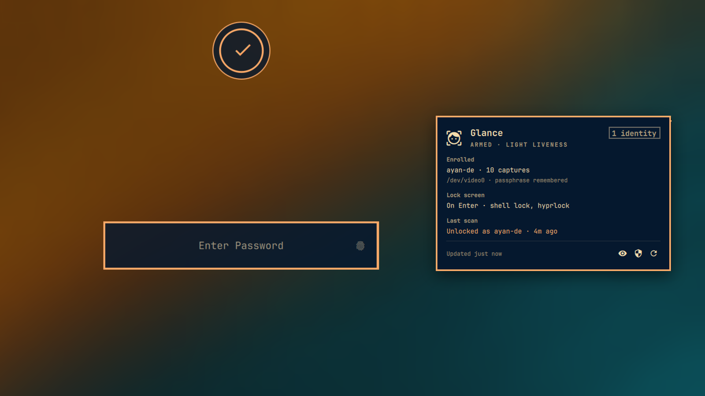

# Glance Face Unlock — Omarchy bar widget



The shell half of [glance-linux](https://github.com/ayandexyz/glance-linux): one
bar icon and one panel for the `glanced` face-unlock daemon.

- **Bar icon** shows the face-recognition glyph; it lights while a scan is in
  flight, including a scan started from the lock screen. Right-click runs a
  test scan.
- **Panel** shows whether the daemon is armed, who is enrolled, how the lock
  screen is wired (on Enter, hands-free, or not yet), and what the last scan
  decided and why. When something is still missing it offers exactly one
  button for the one step that unblocks you — start the daemon, enroll, wire
  the lock screen, add the lock screen indicator — with the command it will
  run printed underneath. A lockout after repeated failed scans shows up as
  the last scan's verdict. Inline
  **Arm** takes the passphrase (over stdin, never argv) and can remember it so
  the daemon arms itself at login. **Disarm** and **Test scan** are one click.

Presentation only, by construction: everything the panel does is a `glancectl`
invocation run as you. Nothing here is on the unlock path, and if the shell is
not running PAM talks to the daemon exactly the same.

## What it runs, and how

A shell plugin runs unsandboxed as you, so the process boundary is where the
care goes. Four rules hold for every child process:

- **Absolute paths only.** `/usr/bin/glancectl`, `/usr/bin/systemctl`,
  `/usr/bin/setsid`, `/usr/bin/omarchy-launch-terminal`, `/usr/bin/stat`,
  `/usr/bin/timeout`, `/usr/bin/python3`. Nothing is resolved through `PATH`, so a shadowed
  executable earlier on an inherited `PATH` cannot stand in for the real one.
- **The glancectl it runs is checked before every run.** Whether the default
  or the path you set, each invocation is preceded by one `stat(1)` call over
  every component, and is refused unless the path is absolute, contains no
  symlinks, every directory and the file are owned by root or by you and
  writable by nobody else, and the file is regular and executable. The panel
  prints the component that failed. `stat` also reports the plugin's own uid
  from `/proc/self/status`, so the check trusts the kernel, not `$HOME` or
  `$USER`.
- **The checked object is the object that runs — as a descriptor, not a
  name.** A pathname is resolved afresh by every `exec`, so a check over a
  pathname cannot say what the `exec` went on to open. Nothing here execs a
  pathname. Every invocation runs `/usr/bin/python3` with a short program on
  argv that opens the path **once** (`O_RDONLY | O_NOFOLLOW`), `fstat`s that
  descriptor, refuses unless it is the object `stat(1)` accepted — device,
  inode, size, mtime, owner and mode — and then `execve`s **the descriptor
  itself**. Open, verify and exec all name one open file description, so
  there is no second resolution for anything to be swapped into: a rename
  that lands after the check makes the identity mismatch and nothing runs.
  The interpreter is root-owned, absolute, and already a hard dependency of
  `glanced`, which is a Python entry point; the program travels on argv
  rather than as a file next to the plugin, because the plugin directory is
  user-owned and such a file would itself be swappable. The check also keeps
  that identity between runs, so a `glanced` upgrade is noticed: the new file
  is adopted, and the command queued against the old one is dropped rather
  than run.
- **Children get a pinned environment, a byte ceiling and a deadline that
  covers the whole tree.** `PATH` is set to `/usr/bin:/usr/share/omarchy/bin`
  and `PYTHONPATH`, `PYTHONHOME`, `PYTHONSTARTUP`, `LD_PRELOAD`,
  `LD_LIBRARY_PATH` and `LD_AUDIT` are unset, because `glancectl` is a Python
  entry point and `setup-pam` runs `sudo`. stdout is capped at 64 KiB and
  stderr at 16 KiB per process; a child that writes more is stopped at once
  and what it wrote is discarded rather than parsed or rendered. Every child
  is spawned under `timeout(1)`, which puts it in a process group of its own
  and signals *the group* — SIGTERM, then SIGKILL five seconds later — so the
  deadline (5 s for the check, 10 s for a status poll, 45 s for an action,
  30 s for a launcher) and the output caps reach `glancectl`'s own `sudo`,
  `make` and `omarchy-apply-lock` descendants too, and not just the one pid
  the plugin spawned. The exception is deliberate and visible: the enrollment
  window and the `setup-pam` terminal are handed to a session of their own by
  `setsid`, because a sweep must survive a shell reload; nothing in them is
  read back, and the panel does not wait on them.

All of this is exercised in `tests/run` against a fake glancectl: a flooding
one, one under a world-writable directory, a relative path, a planted
`PYTHONPATH` that must not reach the child, one that is renamed out from under
the path it passed its last check on, and one that hangs with a descendant
behind it — which records the signal it got, so the suite can tell a killed
tree from a killed process. The race itself is run: the identity is taken, a
same-uid rename puts a different executable behind the name, and the exec has
to refuse it unrun — as it does for a symlink dropped in at the same moment.

## Requirements

This widget is a front end. On its own it draws a panel that says
`glancectl was not found`; it does nothing until the daemon it talks to is
installed.

| Dependency | Why | Where |
|---|---|---|
| Omarchy shell (Quattro) | hosts the plugin | ships with Omarchy |
| `glanced` | every reading and every action in the panel is a `glancectl` subprocess | [ayandexyz/glance-linux](https://github.com/ayandexyz/glance-linux) |

The daemon is **not** installed by adding this plugin, and this plugin never
installs, patches, or elevates anything itself — it only runs `glancectl` as
you, and prints the command under every button so you can see what that is.

## Install

```bash
pipx install 'glanced[runtime,gui]'
glancectl install-service
omarchy plugin add https://github.com/ayandexyz/omarchy-glance.git --enable
```

`install-service` fetches the models and writes the user unit, so the daemon
is running before the plugin ever looks for it. The `gui` extra is PySide6,
which the **Enroll** button needs: it opens the passphrase window, because a
button has no terminal to read a passphrase from. Set **glancectl path** in the
widget's settings to the binary pipx installed, spelled out in full:
`~/.local/share/pipx/venvs/glanced/bin/glancectl` with `~` expanded — the
check refuses symlinks, so not the `~/.local/bin/glancectl` link.

Then click the bar icon and follow it. The panel asks for one thing at a time
and gives you a button for each:

1. **Start daemon** — `systemctl --user enable --now glanced`, already done
   for you by `install-service`
2. **Enroll** — asks you to choose a passphrase (it encrypts your face data
   at rest), then opens the guided sweep in a window; look around as it asks
3. **Wire lock screen** — opens a terminal for `glancectl setup-pam`, which
   needs your password, so you can watch every edit it makes to `/etc/pam.d`

After that the panel just shows state, and your lock screen unlocks by face.

### From a glance-linux checkout

`packaging/install.sh` in the daemon repo links this directory into
`~/.config/omarchy/plugins/` for you, so the shell loads the checkout you are
editing:

```bash
packaging/install.sh
omarchy plugin enable io.github.ayandexyz.glance
```

Then set **glancectl path** in the widget's settings to the venv binary,
spelled out in full: `/home/you/glance-linux/.venv/bin/glancectl`. Not `~`,
and not the `~/.local/bin/glancectl` link that `install.sh` makes for your
prompt, because the check above refuses symlinks. Every button then runs the
glancectl you pointed at and nothing else.

## Remove

```bash
omarchy plugin disable io.github.ayandexyz.glance
omarchy plugin remove io.github.ayandexyz.glance
```

That takes the widget off the bar and deletes the plugin directory. It leaves
the daemon alone: nothing about your enrollment, your PAM stack, or the
`glanced` service belongs to this plugin. To undo those, run
`glancectl setup-pam --remove`, `glancectl install-service --remove` and
`pipx uninstall glanced` (or `packaging/install.sh --uninstall` from a
checkout).

## Settings

| key | default | meaning |
|---|---|---|
| `refreshIntervalSec` | 30 | idle poll interval; the panel also refreshes on open and after every action |
| `glancectlPath` | `""` (`/usr/bin/glancectl`) | absolute path to `glancectl`; checked as described above before every run, and executed as the checked object rather than by name |

## IPC

```bash
omarchy-shell io.github.ayandexyz.glance toggle
omarchy-shell io.github.ayandexyz.glance refresh
omarchy-shell io.github.ayandexyz.glance scan
```

## Tests

```bash
tests/run
```

Runs the `GlanceLogic.js` unit tests under node, `omarchy plugin validate`,
qmllint, and a headless Quickshell harness that instantiates the real panel and
backend against `tests/fake-glancectl` — so the process bridge, the stdin
passphrase hand-off, the status contract, the binary check and its identity
retention, the output caps, the process-group deadlines and the child
environment are exercised for real.

## License

MIT — see [LICENSE](LICENSE).
